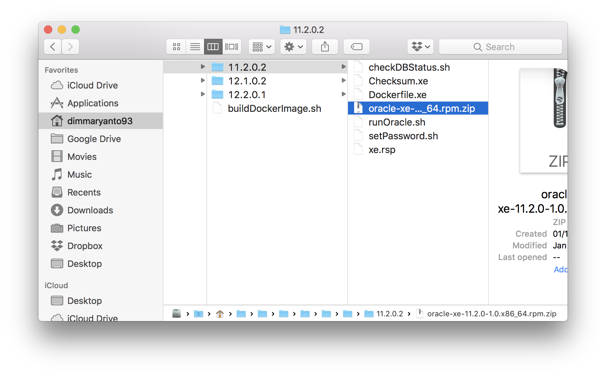
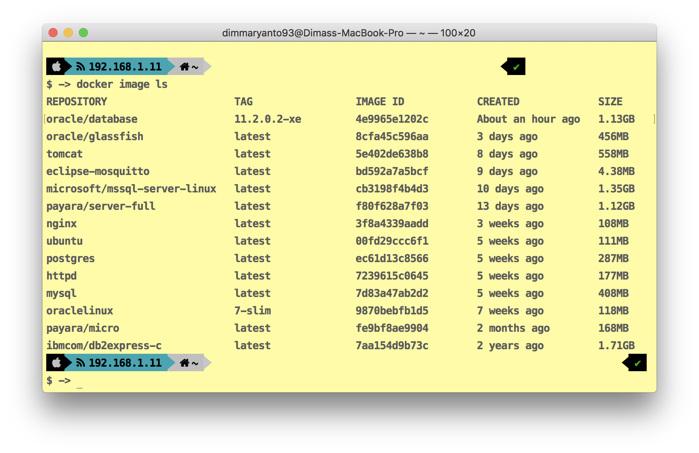
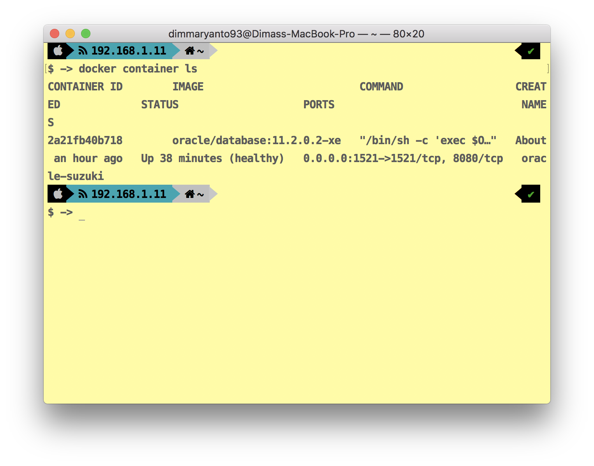
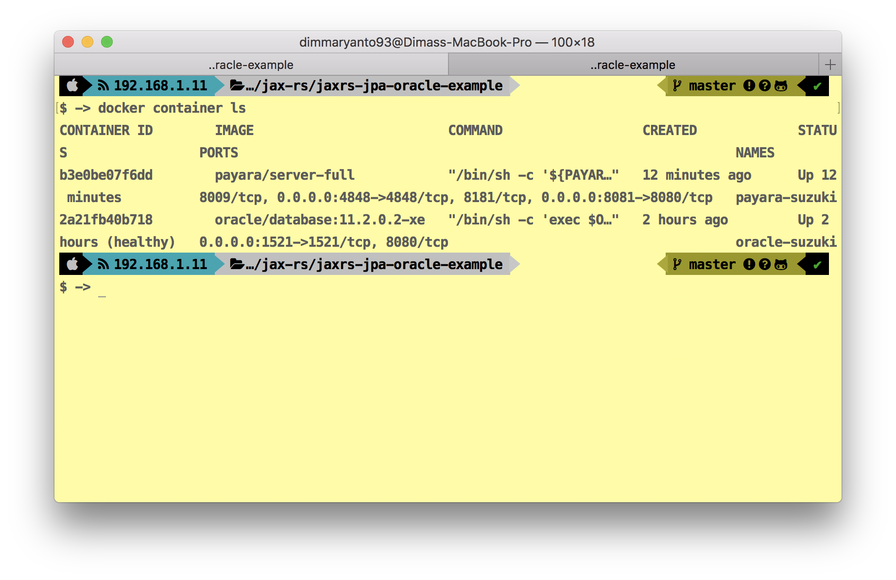

## Installation oracle

Clone repository 

Open terminal lalu `cd path-to-repository/OracleDatabase/dockerfiles/` download [installer oracle xe](http://download.oracle.com/otn/linux/oracle11g/xe/oracle-xe-11.2.0-1.0.x86_64.rpm.zip) 
simpan di folder `11.2.0.2` 




### build image

```bash
[oracle@localhost dockerfiles]$ ./buildDockerImage.sh -v 11.2.0.2 -x -i
```

### check image build

```bash
docker image ls 
```



### run oracle database

```bash
docker container run --name oracle-suzuki --shm-size=1g -p 1521:1521 -e ORACLE_PWD=admin -d oracle/database:11.2.0.2-xe
```

untuk melihat status

```bash
docker container ls
```



### set password system/sys/dba

```bash
cd dev/example/docker-images/oracle-docker-images/OracleDatabase/dockerfiles/11.2.0.2/ && docker exec oracle-suzuki ./setPassword.sh oracle
```

## Installtain Payara server

Pull payara from `docker pull payara/server-full`

### Run server payara/server-full

```bash
docker run -p 4848:4848 -p 8081:8080 --name payara-suzuki -v $(pwd):/opt/payara41/deployments -v /Users/dimmaryanto93/.m2/repository/com/oracle/ojdbc6/11.2.0.3/:/opt/payara41/glassfish/domains/domain1/lib/ext  -d payara/server-full
```

### check configuration

```bash
docker container ls
```

